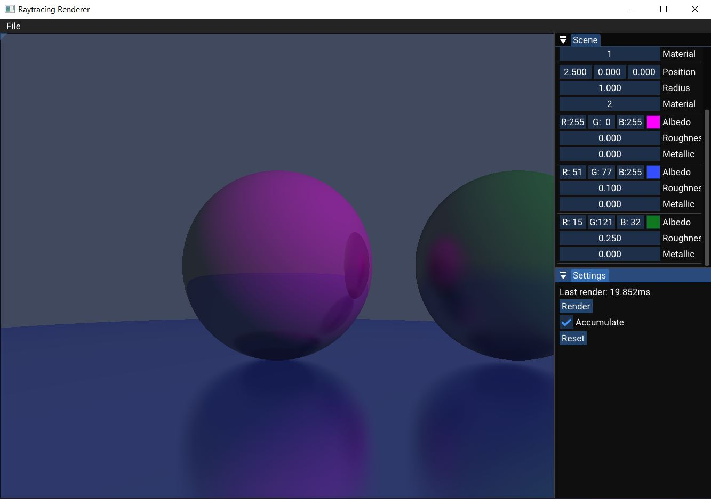

# Ratracing Renderer
## Description
A Raytracing project made with the walnut framework built with Dear ImGui.

## Getting Started
Once you've cloned, run `scripts/Setup.bat` to generate Visual Studio 2022 solution/project files. Once you've opened the solution with Visual Studio, you can run the project
